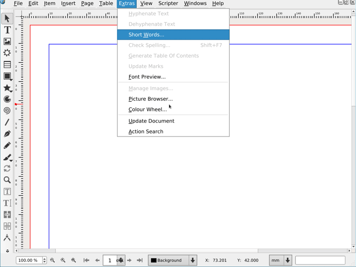

# Action Search

Search the menus and perform the action.

## Install

Clone the `scribus-plugin-actionSearch` repository and put – or symlink – its `src` directory into `scribus/plugins/` as `actionSearch`. Then add 

    ADD_SUBDIRECTORY(actionSearch)

to the `CMakeLists.txt` file in `scribus/plugins/`.

## Run

Currently, "Actions search" is added to the "Extra" menus. It is planned to move it to the Help menu as soon as the [cannot add plugins to some of the menus](https://bugs.scribus.net/view.php?id=15546) ticket is solved.

The default short is `ctrl+/` but:

- It won't be avalaible, if you cannot type  `/` directly, without a modififier.
- It Will not be added to the current shortcuts until the settings are recreated. You will have to add it "manually" in the preferences.

## Implementation

- Each time the command gets called, find all active menu entries.

## Todo

- Move the "Actions search" to the Help menu
- If multiple words are typed, split the string and show the entries that contain all words.
- Find a way to add actions that are inside of dialogs (Properties palettes: display and activate?)
- Maybe add keywords to selected entries to help finding them (transparency, ...)
- Add help entries (like in the Mac OS search dialog).
- retab

## Notes

- Inspired by the [Olive Video Editor](https://github.com/olive-editor/olive) `/` command.  
  <https://github.com/olive-editor/olive/pull/266/files>
